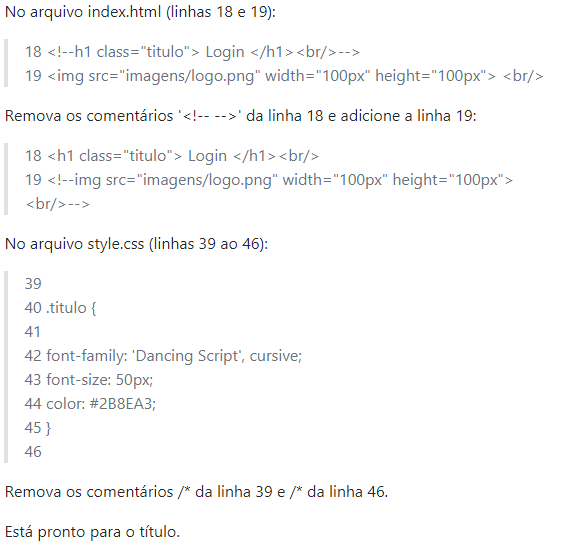
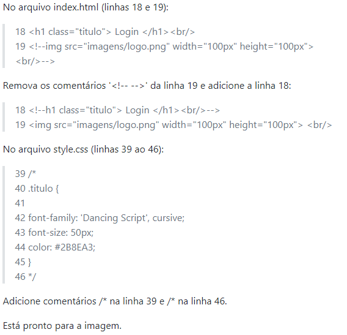
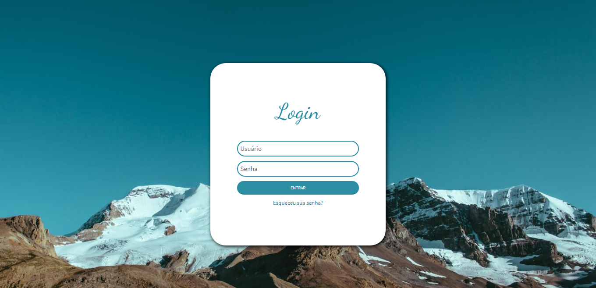
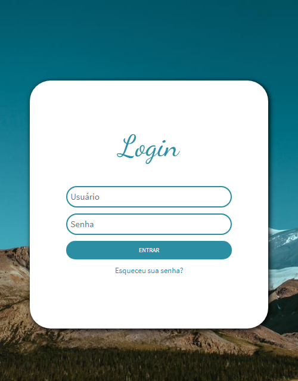
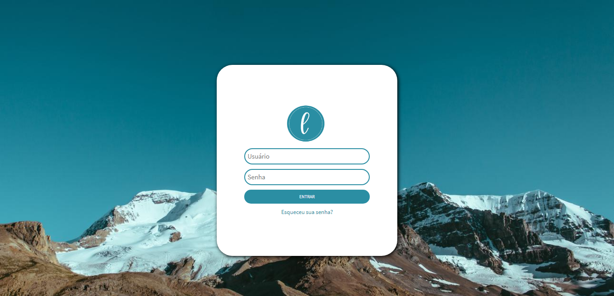
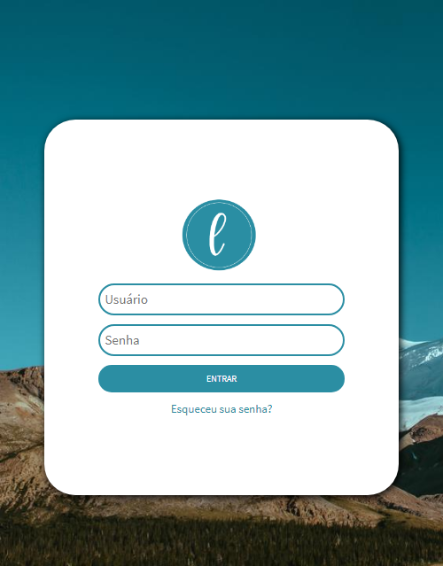

<h1 align="left">
  
</h1>

# L Login
Uma tela simples de login responsivo com título ou imagem na parte superior dos inputs.

## Tabela de conteúdos

<a href="#opcoes"> Opções </a>
  <ul>
    <li> <a href="#opcoestitulo"> Utilizando o título </a> </li>
    <li> <a href="#opcoesimagem"> Utilizando a imagem </a> </li>
  </ul>
<a href="#status"> Status do Projeto </a>  
<a href="#caracteristicas"> Características </a>  
<a href="#tecnologias"> Tecnologias </a>  
<a href="#screenshots"> Screenshots </a>
  <ul>
    <li> <a href="#screenshotsopcoestitulo"> Utilizando o título </a> </li>
    <li> <a href="#screenshotsopcoesimagem"> Utilizando a imagem </a> </li>
  </ul>
<a href="#creditos"> Créditos </a>   
<a href="#licenca"> Licença </a>   

<a name="opcoes"/>

## Opções
Você pode escolher utilizar um título ou imagem na parte superior dos inputs.

<a name="opcoestitulo"/>

### Utilizando o título 
  

<a name="opcoesimagem"/>

### Utilizando a imagem
  

<a name="status"/>

## Status do Projeto
Finalizado

<a name="caracteristicas"/>

## Características
- [x] Login de usuário

<a name="tecnologias"/>

## Tecnologias
- HTML
- CSS

<a name="screenshots"/>

## Screenshots

<a name="screenshotsopcoestitulo"/>

### Versão com título:
**Largo**  
  

**Pequeno**  
  

<a name="screenshotsopcoesimagem"/>

### Versão com imagem:
**Largo**  
  

**Pequeno**  
  

<a name="creditos"/>

## Créditos
[Imagem utilizada para o fundo da tela](https://cutewallpaper.org/download.php?file=/21/wallpaper-5k/Wallpaper-Canada,-4k,-5k-wallpaper,-mountains,-sky,-night-.jpg)

<a name="licenca"/>

## Licença
[MIT](https://choosealicense.com/licenses/mit/)
