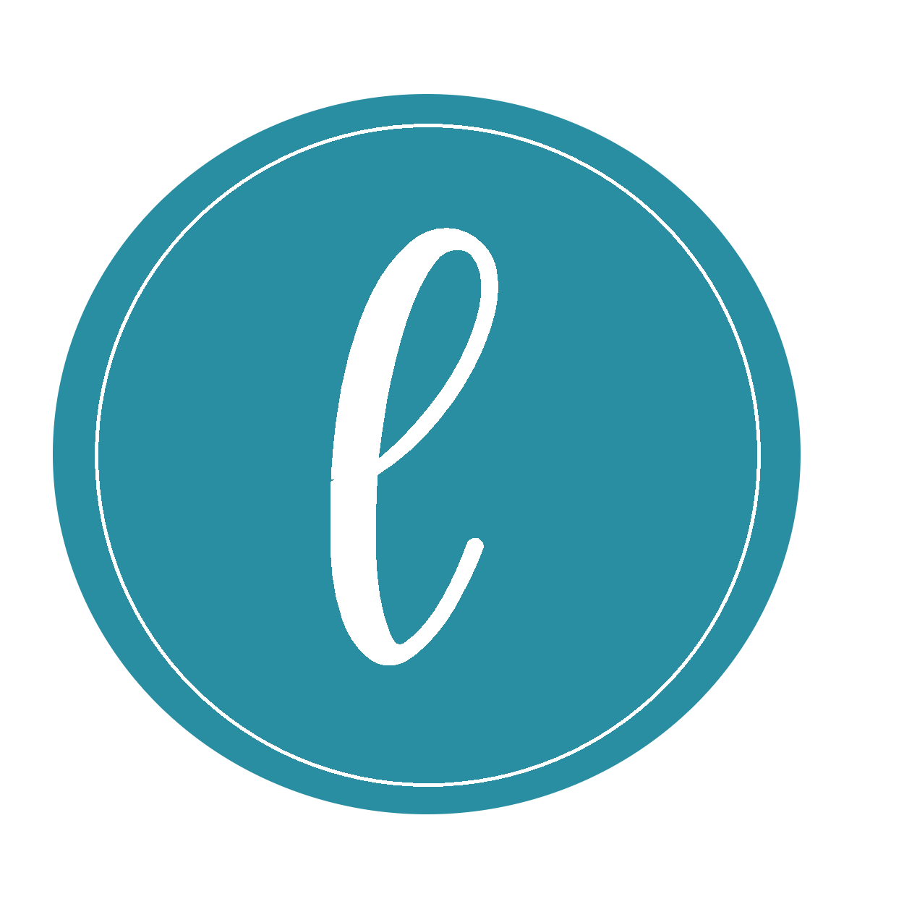

<h1 align="left">
  
</h1>

# L Login
Uma tela simples de login responsivo com título ou imagem na parte superior dos inputs.

## Tabela de conteúdos
 <a href="#opcoes"> Opções </a>   
  <ul>
  <li> <a href="#opcoes"> Utilizando o título </a> </li>
  <li> <a href="#opcoes"> Utilizando a imagem </a> </li>
  </ul>
 <a href="#opcoes"> Créditos </a>   
 <a href="#opcoes"> Licença </a>   

<id="opcoes">
## Opções
Você pode escolher utilizar um título ou imagem na parte superior dos inputs.

### Utilizando o título 
  

### Utilizando a imagem
  
</id>

## Créditos
Imagem utilizada para o fundo da tela: https://cutewallpaper.org/download.php?file=/21/wallpaper-5k/Wallpaper-Canada,-4k,-5k-wallpaper,-mountains,-sky,-night-.jpg

## Licença
[MIT](https://choosealicense.com/licenses/mit/)
